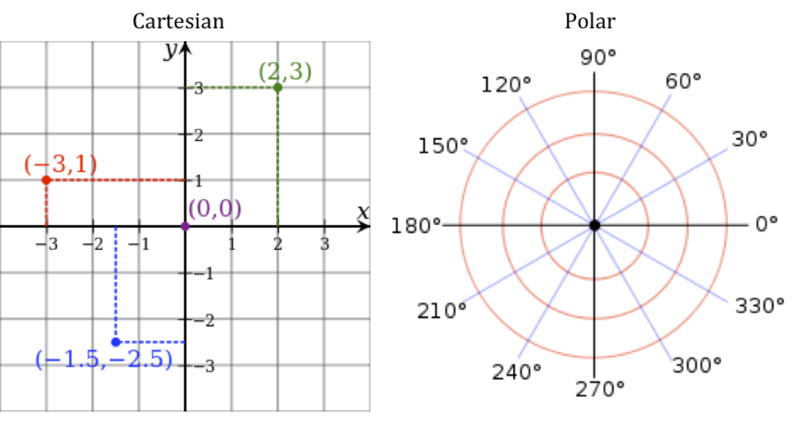

```{r setOptions, message=FALSE, echo = F,  warning=FALSE}

###Note: Some graphs/plots may be different from that shown in the article

###Make sure the below packages are installed on your R environment, else first install them 
###using install.packages("packageName")  and then knit this Rmd file

library(ggplot2)
library(treemap)
library(RColorBrewer)
library(scales)
library(lubridate)
library(dplyr)

library(knitr)


opts_chunk$set(echo = F, tidy = F, results = 'asis', comment = NA)
```

[Original:](https://blog.clevertap.com/how-to-represent-data-with-intelligent-use-of-the-coordinate-system/)

The most widely used coordinate system to represent data is the Cartesian coordinates followed by Polar coordinates.



Source: Wikipedia

Basically, Cartesian coordinate system uses a grid of straight lines while Polar coordinate system uses a grid of circles to represent data.

Let's now look at a few examples where with the appropriate use of the systems discussed above, we will able to visualize different aspects of the data.

The standard graphic visualization for a categorical variable is bar charts. Bar charts are useful if you are dealing with a low number of categories within a variable.

```{r}

dat <- read.csv("../dat.csv")

g <- ggplot(dat, aes(x = OS, y = percent, colour = "red") ) +
        theme_bw() +
        geom_point(size = 4) +
        geom_text(aes(label = percent(round(percent, 2))), size = 4, hjust = 0.4, vjust = -1, colour = "red") +
        geom_bar(aes(y = AppLaunches), stat = 'identity', colour = "blue", alpha = 0.3)+
        theme(legend.position='none')  +
        labs(x = 'Operating System', y = "App Launches  (in \'000)") +
        ggtitle("Bar Chart")
g
```

The bar chart, above represents the App Launches by the Operating system.

Suppose, we need to check the App launches by various countries. In this case, there may be many categories as shown below:

```{r}

dat1 <- read.csv("../dat1.csv")
g <- ggplot(dat1, aes(x = Country, y = percent, colour = "red") ) +
        theme_bw() +
        geom_point(size = 4) +
        geom_text(aes(label = percent(round(percent/100, 2))), size = 4, hjust = 0.4, vjust = -1, colour = "red") +
        geom_bar(aes(y = AppLaunches), stat = 'identity', colour = "blue", alpha = 0.3)+
        theme(legend.position='none', axis.text.x=element_text(angle=90,hjust=1,vjust=0.5))  +
        labs(x = 'Country', y = 'App Launches') +
        ggtitle("Bar Chart")
g
```

The bar chart above makes inefficient use of space since there are many countries. In such a case, you could restrict the bars to the top 5 countries by App Launches, but you'll end up sacrificing the information about other countries which could help you see a much bigger picture.

What if we flip the coordinate system to Polar from Cartesian?

```{r}
p = ggplot(dat1, aes(x=Country, y=AppLaunches, fill = AppLaunches)) + geom_bar(stat = 'identity') + 
    theme_light() +
    scale_fill_gradient(low='white', high='red') +
    theme(axis.title.y=element_text(angle=0)) + ylab("")

p + coord_polar()


```

The above plot looks better than the bar chart on cartesian coordinate system. You can instantly draw the conclusion about the top countries by App Launches.

Well, things are getting better, but still we can't make out the proportion accounted by the top contributors unless we also indicate the percentages along with the counts.

Now, let's look at another class of plots known as Tree Maps, which is plotted on the Cartesian coordinate system. A Tree map is shown in the form of a rectangle with each country shown as nested rectangles inside it. The area occupied by each rectangle is proportional to the count of the App Launches in each country to the total App Launches as shown below:

```{r}
dat$AppLaunches <- dat$AppLaunches / 100
treemap(dat, index = c("Country"), vSize = "AppLaunches", vColor = "AppLaunches", type = "value", algorithm = "pivotSize", sortID = "-size",
        title = "App Launched by Country (in '00)", palette = brewer.pal(12,"Set3"))
```

United States has the highest share of the App Launches since the area occupied by its rectangle is the highest. It can be inferred from the above example, that roughly 60% of the App Launches are accounted by the top 5 countries and they occupy roughly 60% area of the tree map. The rest of the countries account for the other half. You can further extend the tree map to include percentage of App Launches as with bar charts shown above. Tree maps are also useful when you have to show nested hierarchical information like OS version within OS as compared to a stacked bar chart or side-by-side bar chart. Unlike bar charts, tree maps make efficient use of the space provided.

Let's now look at another example. An entertainment company would like to measure the interaction on its app by calculating the video played by its users. It decides to check the counts for video played on each day of the week and each hour in a day. The general practice is to look at a heat map, which is plotted on a Cartesian coordinate system as below:

```{r}
dat <- read.csv("../dat2.csv", stringsAsFactors = F)

dat$Hour <- factor(dat$Hour, levels = c("12 am", "1 am", "2 am", "3 am", "4 am", "5 am", "6 am", "7 am", "8 am", "9 am", "10 am", "11 am", "12 pm", "1 pm", "2 pm", "3 pm", "4 pm", "5 pm", "6 pm", "7 pm", "8 pm", "9 pm", "10 pm", "11 pm"))

dat$Day <- factor(dat$Day, levels = c("Sun", "Mon", "Tues", "Wed", "Thurs", "Fri", "Sat"))
ggplot(dat, aes(Hour, Day)) + geom_tile(aes(fill = Video.Played), colour = "white") + 
  scale_fill_gradient(low = "white", high = "coral2") + theme(axis.text.x = element_text(angle=45, vjust = 1, hjust=1)) 

       
```

We have the Hour of the Day plotted on the x-axis and Day of the Week plotted on the y-axis. Darker shades indicate higher counts. It can be seen from the above heat map that weekdays between 8 pm to 11 pm is the most active period for video played. This could be the prime time for the app. The most active time period for Sunday is 7pm to 8pm followed by 11am to 7 pm, which is clearly a different behavior, compared to other days.

What if we show the same heat map on a polar coordinate system?

```{r}

ggplot(dat, aes(Hour, Day)) + geom_tile(aes(fill = Video.Played), colour = "white") + 
  scale_fill_gradient(low = "white", high = "coral2") + coord_polar()
```

The region between each of the concentric circles represents the day of the week starting with 'Sunday'. Surprisingly, heat map on the polar coordinate system is much easier on the eyes compared to the heat map shown on cartesian coordinate system.

It may thus be concluded that if one uses the coordinate system intelligently, the data represented could be much easier to read and the information embedded may be conveyed faster.